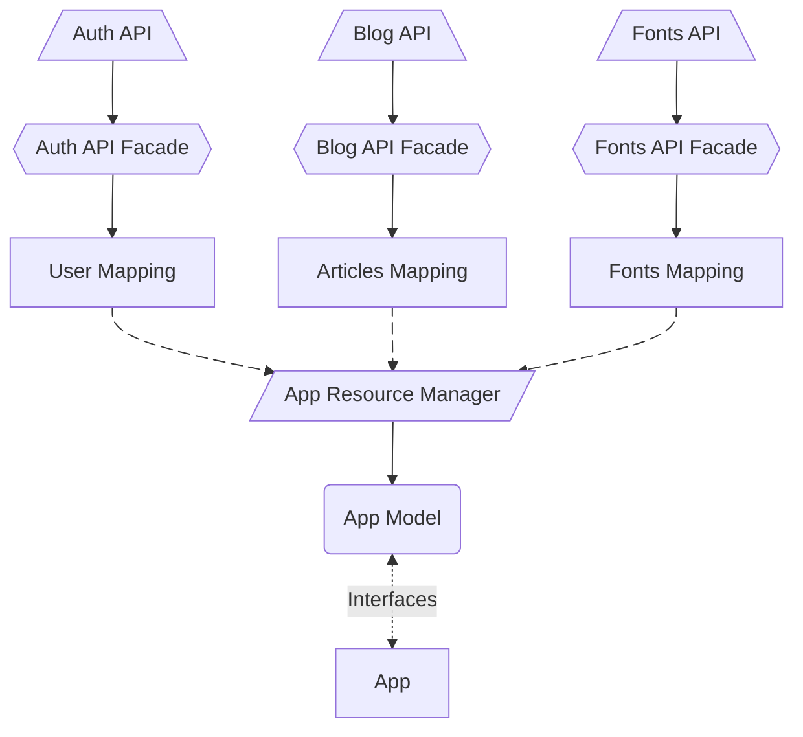

# API Facade

> [!Tip]
> This repository should be treated as a **handbook** rather than a drop‑in library. It collects
> patterns, rationales and small helper modules so that you can craft your own API layer.

**API** is anything that is not a part of your program that your program needs to negotiate with.
Another name for API Facade is **API Client**.

**Facade** is a well-known pattern in software development,
which simply means creating a wrapper over something you want to **enhance** or **conceal**.

Wrapping API access is a very common practice across all web, mobile and desktop apps.
It helps to distinguish between generic and vital requests to web resources.

The API term refers not only to an external server, usually called "backend", but it can be local
file system access or any other remote service your program "talks" to. In this handbook we focus
mainly on web‑based JSON/HTTP resources, but the ideas are easily transferable.

## Role

API Facade hides details such as:

- Host names or any other static paths
- Request Method
- Request Headers
- Resource Versions

API Facade helps with:

- Resolving path variables, e.g. `/user/{id}`
- Search Query building, e.g. `?sort=asc`
- Error handling
- Defining exact invoke points

> [!Note]
> Though it may do much more than that if this seems reasonable or worth trying out.

### Example

```ts
async function getData(path: string | URL, searchParams?: Record<keyof never, string | number>) {
  const url = new URL(path, env.HOST)
  url.search = new URLSearchParams(searchParams).toString()

  try {
    const response = await fetch(url)
    if (!response.ok) {
      throw new Error("HTTP error! status: " + response.status)
    }

    const data = await response.json()
    return data
  } catch (error) {
    if (error instanceof Error === false) throw error

    console.error("Fetch failed: ", error.message)
    return null
  }
}
```

Generally, the API Facade should make it as simple to access a resource as calling a regular function.

## Type Safety

To make your life easier and avoid constant looking into the backend code or in the result of an endpoint,
you can add types for resources you're going to be requesting, so your IDE can hint you.

You can do that by:

- Manually typing request and response for each resource, which can be tough but doable
- Automatically generating [OpenAPI Schemas](https://swagger.io/specification/) on backend and keeping it up-to-date on frontend
- Automatically generating types and functions based on OpenAPI Schemas, e.g. by [openapi-codegen](https://github.com/fabien0102/openapi-codegen) (unofficial tool)
- Creating a library that provides the API facade based on generated OpenAPI Schemas
- Using "monorepository", where both repositories are built together, which allows direct access to backend types via `import` from frontend

> [!Note]
> The OpenAPI specification is actually for **Open** API services, though even if your API is exclusive to internal services,
> it's common to see it's used as playground and to ease understand of requested sources.
> But you should make sure it's protected by a password/auth to avoid any potential risks.

Despite these challenges, type safety remains a valuable goal.

> [!CAUTION]
> When a resource returns a different data for any reasons, the types become irrelevant.

This particular issue created a "very bad" practice of _annotating each property as nullish_,
which creates excessive type checking in every place of usage.

Moreover, the schemas may not be complete, they may contain mistakes or be created for a different content type.
That's why you need to read the next section.

## Response Validation

To make sure that data that a server responded with matches some expected structure, [JSON Schema](https://json-schema.org/understanding-json-schema/about) validation is used.
There are many ways to ensure a response is correct, but JSON Schema is most convenient as it's declared as JSON and can be used for type inference as well.

A common pattern is to generate a runtime schema (using `zod`, `io-ts`, `ajv`, etc.) and
run it against the payload before returning it from the facade:

```ts
import { z } from "zod"

class User {
  id: number
  name: string
}

const UserSchema = z.object({ id: z.number(), name: z.string() })
type User = z.infer<typeof UserSchema>


async function fetchUser(id: number): Promise<User> {
  const response = await fetch(`/api/users/${id}`)
  const payload = await response.json()

  const parsed = UserSchema.safeParse(payload)
  if (!parsed.success) {
    console.warn("validation failed", parsed.error)
    throw new Error("API returned unexpected shape")
  }
  return parsed.data
}
```

A common misconception is to treat such schema as both an interface and a validator,
but they are not the same thing. Of course, these libraries are trying to combine these two things, but it's better to treat them separately, as it helps starting off simple with just interfaces and then adding validation when you need **actually** it, rather than trying to jump into complexity straight away, ending up with a very complex and hard to maintain codebase.

Such schema is universal for both consumer and provider:
a provider (e.g. backend) defines object schemas manually or via Decorators,
a consumer (e.g. frontend) infers or generates types from the schemas, creating well-documented provider representation.

> [!CAUTION]
> If provider schema changes first, while consumer remains unupdated - the pipe is broken.
> If consumer schema changes first - the same happens too.

This can be healed with _annotating each property as nullish_, which leads to ... (read in the previous section).
Another cure is to define what is tolerable for your app and what is vital.
It's a good balance between strict and lazy validation, but it introduces inconsistencies between services types.
But it requires higher discipline, attention to types, good documentation and folder structure to avoid confusion.

### Best Practices

#### Don't create validation problems for yourself

Don't validate the response aggressively in production: don't throw errors, remove unknown properties, ignore nullish mismatch nor log warnings on value mismatch.
Let the error happen and log it, if all good - you're lucky. You can enable validation only for development and testing. The wrong data may lead to unexpected look or behavior, but it may not be critical, you should decide where the line between "critical" and "non-critical" lies and adjust the crashing and logging accordingly.

In development (debug) mode, log the errors and maybe make "toasts" to see something is wrong immediately.
Of course, you can allow errors to be thrown as well - decide what is more convenient for you in development.

#### Backend

Make sure the backend (or remote) server has tests if response mismatch happens too often in the same place.

And remember that response mismatch is always backend issue, you don't need to torture frontend (or your server).
You should only type well and create safe guards if something doesn't work out as it's planned, but it shouldn't crash your app/server entirely, keep it going.

To keep track of errors in production, use monitoring services like Sentry.
They will log any errors happening in production, which you can later analyze and fix.

### Request Validation

The request doesn't need validation, especially if Type Safety is already in place.

Validation of a request body should occur in the backend; client‑side guarding is mostly for
developer convenience and does not improve security. In fact, rejecting requests on the
client can lead to confusing behaviour, e.g. a user cannot submit a form because the
frontend is being too strict while the server would happily accept it.

#### Bad Example

```ts
function login(data: any) {
  const result = schema.safeParse(data)
  if (!result.success) {
    throw new Error("request shape invalid")
  }
  return fetch("/api", { method: "POST", body: JSON.stringify(data) })
}
```

A better practice is to rely on TypeScript for development and log warnings in
`debug` builds; nothing should be thrown in production.

## Content Type Conversion

HTTP APIs carry bodies in different formats: JSON, form data, blobs and arbitrary binaries.
It's much more convenient to have your facade handle the conversion so the callers can work with native objects.
Of course, it's hard to cover every possible content type, but JSON<->FormData and is very common pair to care about.

```ts
export function toBody(data: any, contentType: string) {
  switch (contentType) {
    case "application/json": return JSON.stringify(data)
    case "multipart/form-data": {
      const formData = new FormData
      for (const [key, value] of Object.entries(data)) {
        formData.append(key, String(value))
      }
      return formData
    }
    default: return data
  }
}
```

Look at [`BodyTypeConverter`](./api/BodyTypeConverter.ts) for a more elaborate implementation that also handles parsing responses.

## File Upload Progress

Uploading files introduces unique challenges: progress feedback, multipart encoding, and size limits.

### Outline

- **Progress tracking** — using `XMLHttpRequest` `upload.onprogress` or `fetch` with a `ReadableStream`
  - Wrapping `fetch` to report bytes sent vs total
  - Percentage calculation and throttled callbacks
- **Multipart encoding** — `FormData` with `Blob`/`File` entries
  - Auto-detection of file fields vs regular fields
  - Content-Type boundary handling
- **Upload cancellation** — `AbortController` wired to a cancel button
- **Retry for failed chunks** — resumable uploads with range headers
- **Progress in the facade API**
  - `upload(resource, file, { onProgress })` callback pattern
  - Returning `{ promise, cancel }` tuple
- **Preview generation** — creating object URLs from local files before upload

## Path Params Resolving

REST endpoints may include variable segments like `/user/{id}` or `/user/:id`. A facade should
provide a small helper so you do not concatenate strings by hand and accidentally forget URL‑encoding.

```ts
function resolvePath(template: string, params: Record<string, string | number>) {
  return template.replace(/\{(\w+)\}/g, (_, name) => encodeURIComponent(params[name].toString()))
}

resolvePath("/users/{id}", { id: 42 }) // => "/users/42/posts/7"
```

See [`Endpoint.ts`](./api/Endpoint.ts) for a more robust implementation that also supports optional segments and query parameters.

### JS Standard URL Pattern

Recently, the [`URLPattern` API](https://developer.mozilla.org/en-US/docs/Web/API/URLPattern) has been added to JavaScript, which provides a built‑in way to define and resolve URL patterns.

It's not useful for path resolution, but rather for matching, though it's important to know because it uses `/users/:id` syntax, it's more common in routing, so it can be a good idea to align your API client with this convention.

## Search Query Building

Building query strings is tedious and error‑prone if you assemble them manually.
A façade can expose a fluent API that accepts typed query parameters and handles
encoding for you.

```ts
const query = new URLSearchParams
if (filters.name) query.set("name", filters.name)
query.set("sort", sortBy + ":" + direction)
const url = `/users?${query.toString()}`
```

### Sorting (#!Needs Review)

Within query-building, sorting often requires more structure than a single parameter. The choice of
how to communicate sorting between frontend and backend affects both complexity and flexibility.

#### Simple Single Sort

The most basic form accepts a property and direction:

```ts
function buildSort(field: string, direction: "asc" | "desc") {
  const params = new URLSearchParams()
  params.set("sortBy", field)
  params.set("sortOrder", direction)
  return params
}

// => `?sortBy=user.status&sortOrder=asc`
```

See [SortQuery.ts](./api/sorting/SortQuery.ts) for a complete example.

#### Multiple Sorts: Two Approaches

When sorting by multiple fields, there are two common strategies that differ in URL structure
and semantics:

**Stacked Params:** Repeat the sort parameters in order

```ts
// Request: ?sortBy=status&sortOrder=asc&sortBy=createdAt&sortOrder=desc
// Pros: Clear semantics, order preserved
// Cons: Params must match in length
```

**Array-like Format:** Comma-separated or delimited fields and directions

```ts
// Request: ?sortBy=status,createdAt&sortOrder=asc,desc
// Pros: Compact, single query string per param
// Cons: Order is implicit, requires agreed delimiter
```

There is also a **compact** format combining field and direction:

```ts
// Request: ?sort=status:asc,createdAt:desc
// Pros: Most compact, self-contained pairs
// Cons: Requires parsing field:direction pairs
```

See [MultiSort.ts](./api/sorting/MultiSort.ts) for implementations of all three formats with
parsing and building functions.

#### Record-Based Sorting: Field => Direction Objects

Instead of arrays of `{field, direction}`, you can work directly with objects mapping fields to directions.
This is more intuitive to work with but requires choosing a serialization format:

```ts
// JavaScript object representation
const sort = {
  "status": "asc",
  "user.createdAt": "desc"
}

// Can be serialized multiple ways:
```

**Option 1: Compact pairs** - Single `sort` param with field:direction pairs

```ts
// Query: ?sort=status:asc,user.createdAt:desc
// Pros: Most compact, self-contained, easy to read
// Cons: Requires custom parsing
buildRecordCompactSort({ status: "asc", "user.createdAt": "desc" })
```

**Option 2: Stacked pairs** - Repeated `sort` params with field:direction pairs

```ts
// Query: ?sort=status:asc&sort=user.createdAt:desc
// Pros: Clear semantics, good for dynamic building
// Cons: Slightly more verbose than compact
buildRecordStackedSort({ status: "asc", "user.createdAt": "desc" })
```

**Option 3: Bracket notation** - Array-like notation with field names as keys

```ts
// Query: ?sort[status]=asc&sort[user.createdAt]=desc
// Pros: Familiar PHP/form-like syntax, widely supported by backends
// Cons: More complex URL encoding, requires manual string building
buildRecordBracketSort({ status: "asc", "user.createdAt": "desc" })
```

**Option 4: Using `qs` library** - Let the library handle serialization

```ts
import qs from 'qs'

const sort = { status: "asc", "user.createdAt": "desc" }

// Automatic serialization with various formats:
qs.stringify({ sort })                           // Handles multiple formats automatically
// Recommended: eliminates custom parsing on both frontend and backend
```

The `qs` library (used by Express, UmiJS, and many others) automatically handles all these
serialization formats and is the **recommended approach** if your project already depends on it.

See [MultiSort.ts](./api/sorting/MultiSort.ts) for builders and parsers for all record-based options.

#### Dot-Chained Properties: Full Diversity vs Custom Definitions

**Full Diversity** - Consumer controls any sortable field by path:

The consumer (`frontend`) specifies the exact property path in the returned data:

```ts
const users = await api.users.list({
  sort: [
    { field: "profile.name", direction: "asc" },
    { field: "metadata.tags[0]", direction: "desc" },
  ],
})

// => GET /api/users?sortBy=profile.name&sortBy=metadata.tags[0]&sortOrder=asc&sortOrder=desc
```

**Pros:** Maximum flexibility; consumer is not constrained by the backend
**Cons:** Exposes internal data structure; expensive operations may be sorted (DB joins, computed fields)

**Custom Definitions** - Backend restricts sortable fields per endpoint:

Instead of accepting arbitrary dot-chained paths, the backend only allows a predefined set of
sortable fields. The consumer uses friendly names; the backend maps them to actual properties:

```ts
// Frontend
api.users.list({
  sort: [
    { field: "status", direction: "asc" },
    { field: "createdAt", direction: "desc" },
  ],
})

// Backend definition
const UsersSortDefinition = {
  status: "status",           // Simple field
  createdAt: "createdAt",
  name: "profile.name",       // Mapped to nested property
  // NOT exposing "password", "internalId", etc.
}

// Backend resolves and filters
const resolved = resolveCustomSort(userSort, UsersSortDefinition)
// => Only allowed fields proceed to query building
```

**Pros:** Encapsulation; backend controls what's sortable; safer for expensive operations
**Cons:** Requires API maintenance; less flexible for consumers

See [CustomSort.ts](./api/sorting/CustomSort.ts) for validation, resolution, and endpoint-based
restrictions.

#### Limiting Sorts Per Endpoint

Different endpoints may expose different subsets of the same resource. A `GET /users/summary`
might allow sorting by only `status` and `name`, while `GET /users/detailed` allows `status`,
`name`, `email`, and custom fields.

The facade can enforce these limits transparently:

```ts
class CustomSortedEndpoint {
  constructor(apiPath: string, sortDefinition: SortDefinition) { ... }
  
  buildQuery(sorts: CustomSortField[]): URLSearchParams {
    // Validates and maps frontend keys to backend properties
    // Ignores unknown fields (safe) or throws (fail‑fast)
    // Applies the endpoint's specific restrictions
  }
}

// Usage
const usersEndpoint = new CustomSortedEndpoint("/api/users", UsersSortDefinition)
const query = usersEndpoint.buildQuery(requestedSorts)
// Only allowed fields are included in the final query
```

This pattern is especially crucial when:

- Fields require expensive database operations (JOINs, aggregations)
- Different users have different permissions (some see computed fields, others don't)
- You want to version endpoints without breaking consumer code

#### Backend Handling

The backend must normalize and validate incoming sort parameters. How you parse depends on
serialization format and your framework. Here are common approaches:

**With `qs` library (recommended):**

```ts
// Express + qs (automatic parsing with your framework)
import qs from 'qs'

app.get('/api/users', (request, response) => {
  const query = qs.parse(request.url.split('?')[1])
  const sorts = normalizeSorts(query.sort)
  // query.sort can be object, string, or array depending on format
})

function normalizeSorts(sort: unknown): SortField[] {
  if (typeof sort === 'object' && !Array.isArray(sort)) {
    // Bracket or object notation: { status: "asc", createdAt: "desc" }
    return Object.entries(sort).map(([field, direction]) => ({
      field,
      direction: direction as SortDirection
    }))
  }
  if (Array.isArray(sort)) {
    // Stacked pairs: ["status:asc", "createdAt:desc"]
    return sort.map(s => {
      const [field, direction] = String(s).split(':')
      return { field, direction: (direction || 'asc') as SortDirection }
    })
  }
  if (typeof sort === 'string') {
    // Compact pairs: "status:asc,createdAt:desc"
    return sort.split(',').map(pair => {
      const [field, direction] = pair.split(':')
      return { field, direction: (direction || 'asc') as SortDirection }
    })
  }
  return []
}
```

**Manual parsing (if not using a library):**

```ts
function parseSortParams(params: URLSearchParams): SortField[] {
  // Determine format by checking which params exist
  if (params.has('sortBy')) {
    // Array/stacked format: ?sortBy=status&sortBy=createdAt&sortOrder=asc&sortOrder=desc
    const fields = params.getAll('sortBy')
    const directions = params.getAll('sortOrder')
    return fields.map((f, i) => ({ field: f, direction: directions[i] || 'asc' }))
  }
  
  const sort = params.get('sort')
  if (!sort) return []
  
  // Compact or stacked pairs format: ?sort=status:asc,createdAt:desc
  // or ?sort=status:asc&sort=createdAt:desc
  return sort.split(',').map(pair => {
    const [field, direction] = pair.split(':')
    return { field, direction: (direction || 'asc') as SortDirection }
  })
}
```

**Validating and applying sorts:**

Always **whitelist allowed fields** to prevent SQL injection and expose only intended fields:

```ts
function applySorts(sorts: SortField[], allowedFields: string[], query: QueryBuilder) {
  const maxSorts = 3 // Prevent expensive queries
  
  for (const sort of sorts.slice(0, maxSorts)) {
    // Whitelist check
    if (!allowedFields.includes(sort.field)) {
      console.warn(`Unauthorized sort field: ${sort.field}`)
      continue
    }
    
    // Validate direction
    const direction = sort.direction.toLowerCase() === 'desc' ? 'DESC' : 'ASC'
    
    // Apply to query (syntax varies by ORM/database)
    query = query.addOrderBy(sort.field, direction)
  }
  
  return query
}

// Usage with CustomSort definitions
const allowedFields = Object.values(UsersSortDefinition)
applySorts(sorts, allowedFields, userQuery)
```

See [BackendHandling.ts](./api/sorting/BackendHandling.ts) for examples in Express, Flask, Deno,
TypeORM, Prisma, and raw SQL.

#### Recommendation

Start with **full diversity** (dot-chained) for small projects where flexibility matters.
Transition to **custom definitions** as your API grows or when you encounter expensive operations.
Use **stacked params** for clarity; **compact format** when URL length is a concern.
Adopt the **`qs` library** if your project uses it—it handles all serialization transparently.
Always **validate and whitelist** fields on the backend.

### Filtering (#!Needs Review)

Filtering allows clients to narrow results by specifying conditions on resource fields. Unlike sorting, filters often need to express **operators** (greater than, contains, in list, etc.), which creates richer serialization challenge.

#### Basic Key-Value Filtering

The simplest form maps field names directly to values, implying an equality check:

```ts
// Request: ?userId=42&status=active&archived=false
const filters = {
  userId: 42,
  status: "active",
  archived: false
}

function filterParams(filters: Record<string, string | number | boolean | undefined>) {
  const params = new URLSearchParams()
  for (const [k, v] of Object.entries(filters)) {
    if (v !== undefined) params.set(k, String(v))
  }
  return params
}
```

Pros: Simple, readable, minimal overhead
Cons: Can only express equality; no support for ranges or complex conditions

See [SimpleFilter.ts](./api/filtering/SimpleFilter.ts) for a complete implementation.

#### Operators and Structured Filtering

Most APIs need to express comparisons beyond equality: `age >= 18`, `status != deleted`, `tags in [admin, user]`. There are several standard ways to structure this.

**Standard Operator Syntax:**

Common operators across frameworks:

- `eq` / `=` - equals (exact match)
- `ne` / `!=` - not equals
- `gt` / `>` - greater than
- `gte` / `>=` - greater than or equal
- `lt` / `<` - less than
- `lte` / `<=` - less than or equal
- `in` - value in list
- `nin` - value not in list
- `like` / `ilike` - substring match (case-sensitive / case-insensitive)
- `exists` - field exists (null check)

#### Filter Structure Variations

There are multiple standard ways to communicate filters between client and server. Each has tradeoffs in readability, URL length, and parsing complexity.

##### Method 1: Stacked Params (Django-style)

Each filter is a separate query parameter. Common in Django ORM, Rails, and many REST APIs.

**Django Notation:**

```
?age__gte=18&status__ne=deleted&tags__in=admin,user,moderator
```

**Colon Notation (more readable, less standard):**

```
?filter=age:gte:18&filter=status:ne:deleted&filter=tags:in:admin,user,moderator
```

Pros:

- Clear semantic separation of each constraint
- Works well for dynamic building
- Familiar to Django developers

Cons:

- Parameters must be repeated in UI building
- Operator and value tightly coupled to field name
- Less discoverable for API consumers

See [StackedFilter.ts](./api/filtering/StackedFilter.ts) for implementations of both Django and colon-based notations, including parsing and building functions.

**Backend Implementation:**

```ts
// Express: Parse Django-style filters
function parseDjangoFilters(params: URLSearchParams) {
  const filters: Record<string, Record<string, any>> = {}
  
  for (const [key, value] of params) {
    const match = key.match(/^(.+?)__(.+)$/)
    if (!match) continue
    
    const [, field, operator] = match
    if (!filters[field]) filters[field] = {}
    filters[field][operator] = value
  }
  return filters
}
```

##### Method 2: Record/Object Notation (Bracket Notation)

Filters represented as nested objects. Multiple serialization strategies exist.

**Bracket Notation (PHP/Form-like, most widely supported):**

```
?filter[user.status][ne]=deleted&filter[age][gte]=18&filter[tags][in]=admin,user
```

JavaScript representation:

```ts
{
  "user.status": { ne: "deleted" },
  "age": { gte: 18 },
  "tags": { in: ["admin", "user"] }
}
```

**Compact Pairs (Self-contained, most compact):**

```
?filter=user.status:ne:deleted;age:gte:18;tags:in:admin,user
```

**JSON Format (Precise, handling complex types):**

```
?filter={"user.status":{"ne":"deleted"},"age":{"gte":18},"tags":{"in":["admin","user"]}}
```

Pros:

- More intuitive JavaScript object representation
- Can be validated against JSON Schema
- Flexible serialization

Cons:

- Bracket notation requires careful URL encoding
- JSON format creates long URLs (often needs POST body instead)
- Multiple formats can be confusing

See [RecordFilter.ts](./api/filtering/RecordFilter.ts) for implementations of bracket, compact, JSON, and `qs` library approaches.

**Using qs Library (Recommended if already a dependency):**

The [`qs`](https://github.com/ljharb/qs) library (used by Express, Next.js, many others) automatically handles nested object serialization across all formats:

```ts
import qs from 'qs'

const filters = {
  "user.status": { ne: "deleted" },
  "age": { gte: 18 }
}

// Automatic serialization
qs.stringify({ filter: filters })
// => filter%5Buser.status%5D%5Bne%5D=deleted&filter%5Bage%5D%5Bgte%5D=18

// Automatic parsing (handles all formats)
const parsed = qs.parse(queryString)
```

#### Dot-Chained Properties: Full Diversity vs Custom Definitions

Similar to sorting, filtering can either allow **full diversity** (consumer controls any filterable field) or enforce **custom definitions** (backend restricts what can be filtered).

##### Full Diversity

Consumer specifies exact property paths in returned data:

```ts
const users = await api.users.list({
  filters: {
    "profile.name": { ilike: "john" },
    "metadata.tags[0]": { eq: "admin" },
    "account.balance": { gte: 1000 }
  }
})

// => GET /api/users?filter[profile.name][ilike]=john&...
```

Pros:

- Maximum flexibility for complex queries
- Consumer not constrained by backend schema changes

Cons:

- **Exposes internal data structure**
- Expensive operations may be queryable (computed fields, JOINs, aggregations)
- Performance surprises (slow arbitrary fields)
- Becomes a de-facto schema contract

##### Custom Definitions

Backend defines which fields can be filtered and how. Frontend uses friendly alias names.

```ts
// Frontend: Only uses allowed filter names
const filters = {
  status: { in: ["active", "pending"] },
  email: { ilike: "test" },
  "tags": { in: ["admin"] } // NOT directly accessing user.roles.permissions
}

// Backend schema restricts what's filterable per endpoint
const UsersEndpointFilters = {
  status: { field: "user.account_status", operators: ["eq", "ne", "in"] },
  email: { field: "email", operators: ["like", "ilike", "eq"] },
  tags: { field: "role", operators: ["eq", "in"] },
  // NOT exposing: password, internalId, secretField, computed_score, etc.
}

// Backend resolves and validates
const resolved = validateAndResolveFilters(clientFilters, UsersEndpointFilters)
// => Only "user.account_status", "email", "role" can be queried
```

Pros:

- **Encapsulation**: Backend controls what's sortable
- **Performance safety**: Backend prevents expensive operations
- **Security**: Hides internal schema, prevents data exposure
- **Versioning**: Change backend schema without breaking client contracts
- **Permissions**: Different users can have different filter sets per endpoint

Cons:

- Requires API maintenance: Adding filterable field = schema update
- Less flexible for complex ad-hoc queries
- Need to coordinate between frontend/backend

**Limiting Filters Per Endpoint:**

Different endpoints often expose different filter capabilities:

```ts
const UsersSummaryEndpoint = {
  status: { field: "status", operators: ["eq", "in"] },
  name: { field: "display_name", operators: ["like"] }
  // Only 2 fields
}

const UsersDetailedEndpoint = {
  ...UsersSummaryEndpoint,
  email: { field: "email", operators: ["like", "eq"] },
  createdAfter: { field: "created_at", operators: ["gte"] },
  role: { field: "role", operators: ["in"] },
  // 5 fields total, additional expensive operations available
}
```

This pattern is crucial when:

- Fields require database JOINs or aggregations
- Different users have different permissions
- Versioning endpoints independently

See [CustomFilter.ts](./api/filtering/CustomFilter.ts) for validation, resolution, and endpoint-based restrictions implementation.

#### Backend Implementation Patterns

The backend must parse incoming filter parameters and safely apply them to queries.

**Express + Knex.js (See [BackendHandling.ts](./api/filtering/BackendHandling.ts) for details):**

```ts
// Parse both Django-style and bracket notation
function parseFilters(req: any): Record<string, Record<string, any>> {
  if (req.query.filter && typeof req.query.filter === "object") {
    return req.query.filter // Bracket notation already parsed
  }
  
  const filters: Record<string, Record<string, any>> = {}
  for (const [key, value] of Object.entries(req.query)) {
    if (key.includes("__")) {
      const [field, op] = key.split("__")
      if (!filters[field]) filters[field] = {}
      filters[field][op] = value
    }
  }
  return filters
}

// Apply to Knex query with validation
function applyFilters(query, filters, schema) {
  for (const [name, ops] of Object.entries(filters)) {
    const def = schema[name]
    if (!def) continue // Whitelist check
    
    for (const [op, value] of Object.entries(ops)) {
      if (op === "gte") query = query.where(def.field, ">=", value)
      if (op === "in") query = query.whereIn(def.field, value.split(","))
      // ... handle other operators
    }
  }
  return query
}
```

**Critical security practices (See [BackendHandling.ts](./api/filtering/BackendHandling.ts) for more examples):**

1. **Whitelist allowed fields**: Validate against schema before building query
2. **Validate operators**: Only allow defined operators for each field
3. **Sanitize values**: Type-check and limit string length
4. **Limit filter count**: Prevent expensive queries with `slice(0, maxFilters)`
5. **Log unauthorized attempts**: Monitor and alert on attacked endpoints

```ts
function safeApplyFilters(filters, schema, maxFilters = 10) {
  const allowed = new Set(Object.keys(schema))
  
  // Whitelist validation
  for (const field of Object.keys(filters)) {
    if (!allowed.has(field)) {
      console.warn(`Unauthorized filter: ${field}`)
      return null // Reject entire request or skip field
    }
  }
  
  // Apply with limits
  let applied = 0
  for (const [field, ops] of Object.entries(filters)) {
    if (++applied > maxFilters) break
    const def = schema[field]
    // Validate and apply...
  }
}
```

#### GraphQL Alternative

In GraphQL, filters are part of the query structure itself, avoiding serialization concerns:

```graphql
query {
  users(
    filters: {
      status: { eq: "active" }
      age: { gte: 18 }
      email: { ilike: "test" }
    }
  ) {
    id
    name
    email
  }
}
```

The resolver receives structured `filters` argument directly, eliminating parsing complexity. See [BackendHandling.ts](./api/filtering/BackendHandling.ts) for GraphQL resolver patterns.

#### Recommendations

**Choose based on your situation:**

1. **Simple projects / hand-written clients**: Start with **simple key-value** filtering (equality only)
2. **Growing APIs / standard REST**: Use **custom definitions** with **Django-style stacked params** (`field__operator=value`)
3. **Complex filtering needs**: Use **record/object notation** with **`qs` library** if already a dependency
4. **Internal/micro-services**: **Full diversity dot-chained** filtering is acceptable if you control both sides
5. **GraphQL**: Use native structured filters; no serialization needed

**General best practices:**

- **Always whitelist** allowed fields on backend
- **Validate operators** against schema
- **Limit filter count** to prevent expensive queries
- **Use custom definitions** as your API scales
- **Document** which fields are filterable per endpoint
- **Version carefully**: Schema changes need coordination between frontend/backend
- Prefer **POST with body** for complex filter structures (very long URLs break caches/logs)

#### Specification References

- **Django ORM**: [Field lookups](https://docs.djangoproject.com/en/stable/topics/db/models/lookups/) - defines `__exact`, `__gt`, `__in`, `__icontains`, etc.
- **RQL (Resource Query Language)**: [rql.io](https://rql.io/) - standardized filter syntax
- **JSON:API**: [Filtering](https://jsonapi.org/examples/#filtering) - recommendations for filter query parameters
- **OpenAPI**: Filter definition patterns in server examples and middleware
- **qs library**: [Documentation](https://github.com/ljharb/qs) - de-facto standard for nested object serialization in Node.js

## HTTP Status Handling

HTTP status codes are how the server communicates the outcome of a request. The facade should interpret these codes and handle them appropriately rather than passing the burden to the consumer.

### The Naive Approach

A very common approach (also appears in MDN docs) is to check only `response.ok`:

```ts
async function fetchUser(id: number) {
  const response = await fetch(`/api/users/${id}`)
  if (!response.ok) return null  // Treats all errors the same
  return response.json()
}
```

**Problems:**

- Loses information: a 404 (not found) is very different from 500 (server error)
- 204 (No Content) and 304 (Not Modified) are success codes but have no body; `response.json()` will fail
- Doesn't distinguish between client errors (400-499) and server errors (500-599)
- Can't implement retry logic (retrying a 400 is pointless; a 503 should be retried)
- Doesn't communicate the actual problem to the user

### The Better Approach: Status-Specific Handling

Always inspect the actual status code to determine the appropriate action:

```ts
async function fetchUser(id: number) {
  const response = await fetch(`/api/users/${id}`)
  
  // Success: 200-299
  if (response.ok) {
    // 202 (Accepted) Strictly depends on your implementation, this may have a body.
    if (response.status === 202) return null
    // 204 (No content).
    if (response.status === 204) return null 
    // 205 (Reset content) means you should update the page or reset a form, which may not require a body.
    if (response.status === 205) return null 

    return response.json()
  }
  
  // Client errors: 400-499
  if (response.status === 400) throw new ClientError("Invalid request", response.status)
  if (response.status === 401) throw new AuthError("Unauthorized", response.status)
  if (response.status === 403) throw new ForbiddenError("Forbidden", response.status)
  if (response.status === 404) throw new NotFoundError("Not found", response.status)
  if (response.status === 409) throw new ConflictError("Conflict", response.status)
  if (response.status === 429) throw new RateLimitError("Too many requests", response.status)
  
  // Server errors: 500-599
  if (response.status >= 500) throw new ServerError("Server error", response.status)
  
  // Fallback for unexpected codes
  throw new HTTPError(`Unexpected status: ${response.status}`, response.status)
}
```

### HTTP Status Codes Enum

Define status codes as constants or an enum to avoid magic numbers:

```ts
enum HTTPStatus {
  // 2xx - Success
  OK = 200,
  Created = 201,
  Accepted = 202,
  NoContent = 204,
  PartialContent = 206,
  
  // 3xx - Redirection
  MovedPermanently = 301,
  Found = 302,
  NotModified = 304,
  TemporaryRedirect = 307,
  PermanentRedirect = 308,
  
  // 4xx - Client Error
  BadRequest = 400,
  Unauthorized = 401,
  Forbidden = 403,
  NotFound = 404,
  MethodNotAllowed = 405,
  Conflict = 409,
  Gone = 410,
  UnprocessableEntity = 422,
  TooManyRequests = 429,
  
  // 5xx - Server Error
  InternalServerError = 500,
  NotImplemented = 501,
  BadGateway = 502,
  ServiceUnavailable = 503,
  GatewayTimeout = 504,
}
```

### Custom Error Classes with HTTP Status

Create an error hierarchy that captures status codes:

```ts
export class HTTPError extends Error {
  constructor(
    message: string,
    public status: number,
    public response?: Response
  ) {
    super(message)
    this.name = "HTTPError"
  }
}

// Specific error types for common case
export class ClientError extends HTTPError {
  constructor(message: string, status: number) {
    super(message, status)
    this.name = "ClientError"
  }
}

export class AuthError extends HTTPError {
  constructor(message: string = "Unauthorized") {
    super(message, HTTPStatus.Unauthorized)
    this.name = "AuthError"
  }
}

export class NotFoundError extends HTTPError {
  constructor(message: string = "Not found") {
    super(message, HTTPStatus.NotFound)
    this.name = "NotFoundError"
  }
}

export class ServerError extends HTTPError {
  constructor(message: string, status: number) {
    super(message, status)
    this.name = "ServerError"
  }
}

export class RateLimitError extends HTTPError {
  constructor(
    message: string = "Too many requests",
    public retryAfter?: number
  ) {
    super(message, HTTPStatus.TooManyRequests)
    this.name = "RateLimitError"
  }
}
```

### General Status Handling Pattern (#! Looks bad)

A reusable helper that maps status codes to errors:

```ts
async function handleResponse<T>(response: Response): Promise<T> {
  // Success with body
  if (response.ok && response.status !== HTTPStatus.NoContent) {
    return response.json()
  }
  
  // Success without body (204, 304)
  if (response.status === HTTPStatus.NoContent ||
      response.status === HTTPStatus.NotModified) {
    return null as any
  }
  
  // Try reading error body
  let errorBody: any
  try {
    errorBody = await response.json()
  } catch {
    errorBody = null
  }
  
  // Route by status code
  switch (response.status) {
    case HTTPStatus.BadRequest:
      throw new ClientError(errorBody?.message || "Bad request", HTTPStatus.BadRequest)
    
    case HTTPStatus.Unauthorized:
      throw new AuthError(errorBody?.message)
    
    case HTTPStatus.Forbidden:
      throw new HTTPError(errorBody?.message || "Forbidden", HTTPStatus.Forbidden)
    
    case HTTPStatus.NotFound:
      throw new NotFoundError(errorBody?.message)
    
    case HTTPStatus.Conflict:
      throw new HTTPError(errorBody?.message || "Conflict", HTTPStatus.Conflict)
    
    case HTTPStatus.UnprocessableEntity:
      throw new HTTPError(errorBody?.message || "Invalid data", HTTPStatus.UnprocessableEntity)
    
    case HTTPStatus.TooManyRequests: {
      const retryAfter = response.headers.get("Retry-After")
      throw new RateLimitError(errorBody?.message, retryAfter ? parseInt(retryAfter) : undefined)
    }
    
    case HTTPStatus.InternalServerError:
    case HTTPStatus.BadGateway:
    case HTTPStatus.ServiceUnavailable:
    case HTTPStatus.GatewayTimeout:
      throw new ServerError(errorBody?.message || "Server error", response.status)
    
    default:
      throw new HTTPError(errorBody?.message || `HTTP ${response.status}`, response.status)
  }
}

// Usage
async function fetchUser(id: number) {
  const response = await fetch(`/api/users/${id}`)
  return handleResponse<User>(response)
}
```

### On-Spot Status Handling

For specific operations, inline checks for distinct behavior:

```ts
async function createUserWithRetry(payload: CreateUserRequest) {
  let attempts = 0
  const maxAttempts = 3
  
  while (attempts < maxAttempts) {
    try {
      const response = await fetch("/api/users", {
        method: "POST",
        body: JSON.stringify(payload)
      })
      
      return handleResponse<User>(response)
    } catch (error) {
      // Retry only on server errors and rate limit
      if (error instanceof RateLimitError) {
        await sleep(error.retryAfter || 60000)
        attempts++
        continue
      }
      
      if (error instanceof ServerError) {
        attempts++
        await sleep(Math.pow(2, attempts) * 1000)  // Exponential backoff
        continue
      }
      
      // Don't retry client errors (400, 404, 409, etc.)
      throw error
    }
  }
  
  throw new Error("Max retries exceeded")
}
```

### Common Misconceptions

#### 1. "putting `status` field in the response body"

```json
{
  "ok": true,
  "status": 200,
  "data": { "id": 1, "name": "John" }
}
```

The HTTP response already brings status code. You don't need to duplicate it in the body. The HTTP layer already communicates success/failure, adding redundant fields may be confusing and puts extra burden on maintainer.

**Better:**

HTTP 200 (OK). Use the response status code itself and the body with the `data`:

```json
{
  "id": 1,
  "name": "John"
}
```

There may be cases when it's just enough to return the status code without body.
For example when a consumer requests an in-background running process, you can simply respond with `202` without body since it has not been completed yet, but was accepted.

#### 2. "Always returning 200 OK, then check an error in the body"

```ts
// Server always returns 200, error is in JSON
{
  "status": "error",
  "message": "User not found"
}
```

Clients expecting success will process this as valid data. Frameworks that check `response.ok` will treat it as success. It also violates HTTP and REST API semantics.

**Better:**

HTTP 404 (Not Found):

```json
{
  "message": "User not found"
}
```

In such cases you may even omit the `message` since it's also being redundant to the status code - the `404` status code already brings "Not Found" label. It's better to add `message` field in the body with details that may help the user better understand the problem.

#### 3. "Returning only 200 and 500"

Using only two status codes loses semantic information:

- 201 (Created) signals a new resource was created (essential for POST)
- 204 (No Content) signals success with no body (prevents parsing errors)
- 400 (Bad Request) signals invalid client input (don't retry)
- 401 (Unauthorized) signals authentication is needed (handle specially)
- 404 (Not Found) signals resource doesn't exist (can cache negatively)
- 409 (Conflict) signals business logic violation (retry later)
- 429 (Too Many Requests) signals rate limiting (apply backoff)

**Better:**

Use the full range of 200-500 codes. Clients may depend on this information.
It's better to follow the standard since it's widely accepted and easy to follow.

Remember: this standard doesn't absolutely enforces anything, it simply provides some semantics to start from, maybe status codes in 200,300,400, and 500 are free and can be customized. But be sure there is a real intent behind your own custom status codes and that you documented them well as it can be **very** confusing.

#### 4. "The API should tell the client what to do"

```json
{
  "error": "unauthorized",
  "action": "redirect_to_login"
}
```

Clients shouldn't interpret error bodies to decide behavior. The HTTP status code + error code is enough.

**Better:**

Use status codes, let the client implement its own policy.

```ts
try {
  await api.fetchUser(id)
} catch (error) {
  if (error instanceof AuthError) { // Assume `AuthError` is based on the status code.
    // Client decides: redirect to login, show modal, etc.
    router.push("/login")
  }
}
```

### Best Practices

1. **Always use semantically correct status codes** - 201 for creation, 204 for no content, 404 for not found, etc.
2. **Use 4xx for client errors that won't succeed on retry** - 400, 401, 403, 404, 409, 422
3. **Use 5xx for server errors that might succeed if retried** - 500, 502, 503, 504
4. **Include `Retry-After` header for 429** - Tells clients how long to wait before retrying
5. **Don't duplicate status in response body** - The HTTP status code IS the status
6. **Provide error details in the body** - `{ "message": "...", "code": "..." }` is acceptable
7. **Log the full context** - Status code, URL, method, request/response for debugging
8. **Monitor error rates by status code** - Track 401s (auth problems), 429s (capacity), 500s (bugs)

### Admit different APIs

It may happen that some of these practices appear in the API that you're dealing with.
If you can't affect the API in anyway - just keep working on that. After all, there might be an actual reason for that exact behavior. Just know APIs can be different.

## Authentication Patterns

The facade is the ideal place to centralize authentication logic so individual call sites never
deal with tokens, refresh flows, or credential storage.

### Outline

- **Token-based auth (Bearer / JWT)**
  - Storage: memory, `localStorage`, `sessionStorage`, httpOnly cookie
  - Token lifecycle: acquire, attach, refresh, retry on 401
  - Auto-refresh with request batching — queue concurrent calls while refreshing
    (implemented in `API.ts` `APIAuthorization`)
- **API key auth**
  - Header: `X-API-Key`
  - Query param fallback when headers aren't available (e.g., SSE)
- **OAuth 2.0 flows**
  - Authorization code + PKCE for SPAs
  - Client credentials for server-to-server
  - Implicit flow (deprecated, but still encountered)
- **Multi-tenant auth**
  - Per-tenant credentials or tokens
  - Tenant resolution from subdomain or header
- **Auth retry strategy**
  - Single 401 → refresh → retry original request
  - Multiple 401s → broadcast logout
- **Facade integration**
  - `Authorization` header injected in a request interceptor
  - `onAuthError` callback for consumer-side redirect
  - See [`APIStable.ts`](./api/stable/APIStable.ts) for a production example

## Error Handling

### Throw vs [Error, Result]

There are two common schools of thought:

1. **Throwing** exceptions
2. **Result tuples** - returning `[result, error]`.
This get rids of `try`/`catch` and enforces handling an error on the spot every time,
an error won't go any deeper in a call stack (e.g `getUser -> handleResponse -> fetch`).

Choose based on your team's style, the handbook dedicates an entire recipe
(`recipes/action-based`) to the tuple approach.

### Custom Codes

Some backends use their own error codes (e.g. `{ code: "USER_NOT_FOUND" }`).
The facade can normalize these into an enum so consumers don't rely on magic
strings:

```ts
enum AppErrorCode { UserNotFound = "USER_NOT_FOUND", ... }
// Or
enum AppErrorCode { UserNotFound = 1040, ... }
```

You can implement a helper that reads the JSON body and infers a such status codes.

## Notifications

Notifications are how the API facade communicates the outcome of a request to the user, especially when something goes wrong.

### Toasts

Toasts (also called snackbars or notifications) are temporary messages shown to the user about the result
of an action. They're commonly used to inform about success, errors, warnings, or informational messages.

#### Relationship to Error Handling and HTTP Status

The HTTP status code and error response inform the **facade** about what happened.
The facade responsibility is to translate that technical information into a user-friendly message.

```ts
// HTTP 409 (Conflict) -> User needs to know why their action failed
// HTTP 429 (Too Many Requests) -> User needs to know to wait and retry later
// HTTP 200 (OK) -> User should know the action succeeded (optional for expected operations)

/** #! Looks weird. */
async function updateUser(id: number, payload: UpdateUserRequest) {
  try {
    const response = await fetch(`/api/users/${id}`, {
      method: "PATCH",
      body: JSON.stringify(payload)
    })
    
    return handleResponse<User>(response)
  } catch (error) {
    if (error instanceof ConflictError) {
      // Show conflict-specific message: user might try again later
      showToast("This user was modified by someone else. Please refresh and try again.", "error")
    } else if (error instanceof RateLimitError) {
      // Show rate limit message: user should wait
      showToast(`Too many requests. Please wait ${error.retryAfter} seconds.`, "warning")
    } else if (error instanceof ClientError) {
      // Show validation error: user needs to fix their input
      showToast(error.message || "Invalid input. Please check your data.", "error")
    } else if (error instanceof ServerError) {
      // Show server error: user should retry later or contact support
      showToast("Server error. Please try again later or contact support.", "error")
    }
    
    throw error
  }
}
```

#### Inline/On-the-Spot Toasts vs Structured Approach (#! Needs Rewrite)

**On-the-Spot Approach:**

Show toasts immediately where the error occurs. Easy to understand context but requires error handling everywhere.

```ts
// Option 1: Call showToast directly in the facade
async function deleteUser(id: number) {
  try {
    const response = await fetch(`/api/users/${id}`, { method: "DELETE" })
    if (!response.ok) {
      showToast("Failed to delete user", "error")
      throw new Error("Delete failed")
    }
    showToast("User deleted successfully", "success")
  } catch (error) {
    console.error(error)
  }
}

// Option 2: Consumer handles toasts when catching errors
try {
  await api.users.delete(userId)
  showToast("User deleted successfully", "success")
} catch (error) {
  showToast("Failed to delete user", "error")
}
```

**Problems with on-the-spot:**

- Toast logic scattered across codebase
- Hard to change toast styling/behavior consistently
- Tests need to mock toast functions
- Reusing facade in different contexts (web, mobile, CLI) becomes difficult
- UI framework dependencies leak into facade

**Structured Approach:**

Return error information, let the consumer decide how to notify. Better separation of concerns.

```ts
// Facade returns typed errors without toasts.
async function deleteUser(id: number) {
  const response = await fetch(`/api/users/${id}`, { method: "DELETE" })
  return handleResponse(response)  // Throws typed errors, no toast calls
}

// Consumer shows notification.
async function handleDeleteClick(userId: number) {
  try {
    await api.users.delete(userId)
    showToast("User deleted successfully", "success")
  } catch (error) {
    if (error instanceof NotFoundError) {
      showToast("User no longer exists", "warning")
    } else if (error instanceof ServerError) {
      showToast("Server error. Please try again later.", "error")
    } else {
      showToast("Failed to delete user", "error")
    }
  }
}
```

**Advantages:**

- Facade remains framework-agnostic
- UI logic stays in UI layer
- Easy to reuse facade across different projects
- Testing doesn't require mocking toast functions
- Can customize messages per context

#### Recommended Pattern: Generic Error Codes

A middle ground: provide error codes in the facade, but keep message formatting in the consumer:

```ts
// Facade defines error codes
export enum APIErrorCode {
  NotFound = "NOT_FOUND",
  Unauthorized = "UNAUTHORIZED",
  Conflict = "CONFLICT",
  ValidationFailed = "VALIDATION_FAILED",
  RateLimit = "RATE_LIMIT",
  ServerError = "SERVER_ERROR",
}

// Enhanced error class carries code and metadata
export class APIError extends Error {
  constructor(
    public code: APIErrorCode,
    message: string,
    public status: number,
    public metadata?: Record<string, any>
  ) {
    super(message)
    this.name = "APIError"
  }
}

// Facade throws typed errors with codes
async function handleResponse<T>(response: Response): Promise<T> {
  if (response.ok) return response.json()
  
  const body = await response.json().catch(() => ({}))
  
  if (response.status === 404) {
    throw new APIError(APIErrorCode.NotFound, body.message || "Not found", 404)
  }
  if (response.status === 409) {
    throw new APIError(APIErrorCode.Conflict, body.message || "Conflict", 409, {
      conflictingFields: body.conflictingFields
    })
  }
  if (response.status === 429) {
    const retryAfter = response.headers.get("Retry-After")
    throw new APIError(APIErrorCode.RateLimit, "Too many requests", 429, {
      retryAfter: retryAfter ? parseInt(retryAfter) : 60
    })
  }
  // ... more codes
  
  throw new APIError(APIErrorCode.ServerError, body.message || "Error", response.status)
}

// Consumer maps codes to localized messages and shows toasts
const errorMessages: Record<APIErrorCode, string> = {
  [APIErrorCode.NotFound]: "Not found",
  [APIErrorCode.Conflict]: "Conflict",
  [APIErrorCode.RateLimit]: "Too many requests",
  [APIErrorCode.ServerError]: "Something went wrong on the server",
  // ... more messages
}

async function handleDeleteClick(userId: number) {
  try {
    await api.users.delete(userId)
    showToast("User successfully deleted", "success")
  } catch (error) {
    if (error instanceof APIError) {
      let message = errorMessages[error.code] || error.message
      
      // Customize based on context or metadata
      if (error.code === APIErrorCode.RateLimit) {
        message = errorMessages.RateLimit
      }
      
      showToast(message, "error")
    }
  }
}
```

#### Common Misconceptions

##### 1. "Toast for every error, including expected ones"

```ts
async function fetchUser(id: number) {
  try {
    return await api.user.fetch(id)
  } catch (error) {
    showToast("Error fetching user", "error")  // Even for non-critical errors
    return null
  }
}
```

Not all errors need user feedback.
Silent failures are sometimes acceptable (fallbacks, optional data loads).

**Better:**

```ts
async function fetchUser(id: number) {
  try {
    return await api.user.fetch(id)
  } catch (error) {
    // Only show critical errors
    if (error instanceof ServerError) {
      showToast("Server error. Please try again later.", "error")
    }
    // Optional data failures, don't show toast
    console.error("Failed to fetch user:", error)
    return null
  }
}
```

Though you can still show all the toasts for you in development mode,
but for production builds it should be avoided.

##### 2. "Success toasts for expected operations"

```ts
button.onClick = async () => {
  await api.users.create(data)
  showToast("User created successfully", "success")
}
```

Success toasts are useful only when:

- The action takes time and user feedback confirms completion
- The result is surprising or significant
- User explicitly requested notification

For example: Buttons are usually rendered with a spinner loading icon, which doesn't require extra toast message.

**Better:**

```ts
// Silent success for expected operations
button.onClick = async () => await api.users.create(data)

// Explicit success for long operations
button.onClick = async () => {
  showToast("Sending email...", "info")
  await api.mail.send(emailData)
  showToast("Email sent", "success")
}
```

##### 3. "Error code in the message"

```ts
// Technical message exposed
showToast("ERR_USER_NOT_FOUND_404", "error")

// Mix of technical and user language
showToast("ClientError [409 CONFLICT], error at code.js:123:45; Your changes conflict with another user's update", "error")
```

Users shouldn't see error codes, they need user-friendly explanations.

**Better:**

```ts
showToast("This user was modified by someone else. Please refresh and try again.", "error")
```

##### 4. "Toast as the only error notification"

Toasts are temporary and can be missed, critical errors need persistent messaging:

```ts
// Critical auth error shown as toast only
try {
  await api.sensitive.operation()
} catch (error) {
  if (error instanceof AuthError) {
    showToast("Session expired", "error")  // Might be missed!
  }
}
```

**Better:**

```ts

// Redirect + optional toast for persistent notification
try {
  await api.sensitive.operation()
} catch (error) {
  if (error instanceof AuthError) {
    showToast("Session expired. Redirecting to login...", "warning")
    setTimeout(() => router.push("/login"), 1000)
  }
}
```

#### Best Practices

1. **Let consumers handle toasts** - Don't call `showToast()` from the facade
2. **Use error codes for routing logic** - Consumer decides message and toast behavior
3. **Provide context in metadata** - Retry counts, retry-after seconds, conflicting fields
4. **Show toasts only for problems and significant actions** - Not for every success
5. **Make messages actionable** - Tell user what to do, not just what went wrong
6. **Avoid error codes in messages** - Translate to human language
7. **Consider toast context** - Page navigation, form submission, background sync all need different handling

### Localization

Error messages need to be translated to match the user's language and region.
The facade can provide structure (error codes, metadata) while the consumer application
handles localization.

#### Approaches

##### Option 1: Localize in Consumer (Recommended)

The facade returns error codes; the consumer translates them using a `t()` function from their i18n library
(e.g., React Intl, Vue i18n, next-intl).

```ts
// Facade provides codes, which are The Same on the backend.
export enum APIErrorCode {
  NotFound = "NOT_FOUND",
  Unauthorized = "UNAUTHORIZED",
  ValidationFailed = "VALIDATION_FAILED",
}
```

**`translations/en.json`**

```json
{
  "errors": {
    "NOT_FOUND": "This item no longer exists",
    "UNAUTHORIZED": "You don't have permission to access this",
    "VALIDATION_FAILED": "Please check your input"
  }
}
```

**`translations/es.json`**

```json
{
  "errors": {
    "NOT_FOUND": "Este elemento ya no existe",
    "UNAUTHORIZED": "No tienes permiso para acceder a esto",
    "VALIDATION_FAILED": "Por favor verifica tu entrada"
  }
}
```

```ts
try {
  await api.resource.delete(id)
} catch (error) {
  if (error instanceof APIError) {
    const message = t(`errors.${error.code}`)
    showToast(message, "error")
  }
}
```

**Advantages:**

- Facade remains localization-agnostic
- Reusable across different projects with different i18n setups
- Consumer controls all translations
- Easy to update messages without changing facade code

##### Option 2: Localized Messages from Backend (#! Needs Rewrite)

The backend sends localized messages; facade passes them through.

```json
{ // API Response
  "error": "NOT_FOUND",
  "message": "This user no longer exists",  // Pre-translated on backend
  "localizedMessage": "Este usuario ya no existe"  // Alternative language
}
```

```ts
// Facade passes message through
throw new APIError(code, body.message, status)
// Consumer uses message directly
showToast(error.message, "error")
```

**Advantages:**

- No client-side translation needed
- Consistent with backend localization

**Disadvantages:**

- Backend must know all supported languages
- Hard to add new language without backend change
- Hard to keep translations in sync across projects

**Recommended:** Use Option 1 for flexibility and maintainability.

#### Handling Server-Provided Messages

If the server provides detailed messages (validation errors, specific reasons), include them alongside localized codes:

```ts
export class APIError extends Error {
  constructor(
    public code: APIErrorCode,
    message: string,  // Server's detailed message
    public status: number,
    public details?: Record<string, string>  // Validation errors, etc.
  ) {
    super(message)
  }
}

// Consumer combines localized code message with server details
try {
  await api.user.create(data)
} catch (error) {
  if (error instanceof APIError && error.code === APIErrorCode.ValidationFailed) {
    // Show localized header
    showToast(t("errors.VALIDATION_FAILED"), "error")
    
    // Show server-provided field details (if any)
    if (error.details) {
      for (const [field, detail] of Object.entries(error.details)) {
        showFieldError(field, detail)  // E.g., form field validation highlight
      }
    }
  }
}
```

#### Pluralization and Formatting

For messages that vary by number or context, use i18n library features:

```ts
// translations/en.json
{
  "errors": {
    "RATE_LIMIT": "You can retry in {seconds, plural, one {1 second} other {# seconds}}"
  }
}

// Consumer
const message = t("errors.RATE_LIMIT", { seconds: error.metadata?.retryAfter })
showToast(message, "warning")
```

#### Parameter Substitution

Include dynamic values in metadata, let consumer localize with parameters:

```ts
// Facade provides code and parameters
throw new APIError(APIErrorCode.ValidationFailed, "Validation failed", 422, {
  count: 3,
  fields: ["email", "phone", "name"]
})

// translations/en.json
{
  "errors": {
    "VALIDATION_FAILED": "{count} field{count, plural, =1 {} other {s}} invalid: {fields}"
  }****
}

// Consumer
const message = t("errors.VALIDATION_FAILED", {
  count: error.metadata?.count,
  fields: error.metadata?.fields?.join(", ")
})
```

#### Header-Based Localization

Language preferences can be communicated via HTTP headers, avoiding the need to manually pass language codes:

**Client sends language preference:**

```ts
// Facade automatically includes Accept-Language header
async function fetchWithLocalization(url: string, options: RequestInit = {}) {
  const userLanguage = navigator.language || "en-US"  // Browser language
  
  const response = await fetch(url, {
    ...options,
    headers: {
      ...options.headers,
      "Accept-Language": userLanguage
    }
  })
  
  return handleResponse(response)
}

// Backend receives Accept-Language and can respond in preferred language
// GET /api/users -> Accept-Language: es-ES
// Response includes error messages in Spanish
```

**Backend sends localization metadata:**

The backend can include information about the language it used or supported languages in response headers or body:

```ts
// Response headers
Content-Language: es-ES  // Language of the response

// Or in response body
{
  "data": { /* ... */ },
  "meta": {
    "language": "es-ES",
    "supportedLanguages": ["en-US", "es-ES", "fr-FR", "de-DE"]
  }
}
```

**Server-side localization:**

If the backend handles localization, it may respond with pre-translated error messages:

```ts
// Client sends preference
const response = await fetch("/api/users", {
  headers: { "Accept-Language": "es-ES" }
})

// Backend responds with localized messages
{
  "error": "NOT_FOUND",
  "message": "Este usuario ya no existe"  // Pre-translated based on Accept-Language
}
```

**Combining client and server localization:**

For optimal flexibility, send language preferences to the server but also maintain client-side translations as fallback:

```ts
// Facade sends language preference to backend
async function fetchWithLocalization<T>(
  url: string,
  userLanguage: string = navigator.language
): Promise<T> {
  const response = await fetch(url, {
    headers: { "Accept-Language": userLanguage }
  })
  
  return handleResponse(response)
}

// Consumer uses server message if available, falls back to client localization
try {
  await api.resource.fetch()
} catch (error) {
  if (error instanceof APIError) {
    // Prefer server's message (already localized) if available
    const message = error.message || t(`errors.${error.code}`)
    showToast(message, "error")
  }
}
```

#### Best Practices

1. **Use error codes, not hard-coded messages** - Codes are stable, messages can change
2. **Localize in the consumer** - Keep facade framework-agnostic
3. **Send Accept-Language header** - Let backend know client's language preference
4. **Implement fallback localization** - Always have client-side translations as backup
5. **Provide metadata for context** - Numbers, field names, retry-after seconds
6. **Use i18n library features** - Pluralization, formatting, parameter substitution
7. **Document supported error codes** - List all `APIErrorCode` values and their meanings
8. **Handle content-language mismatches** - Server may not support requested language
9. **Test localization** - Ensure messages render correctly in all supported languages
10. **Keep translation files organized** - Group by feature or error type for maintainability

## Body Mocking

During development it can be useful to return fake data when the real API is
broken or slow. The `debug.mock` option in `IAPIOptions` triggers automatic
replacement of invalid responses with a schema‑generated mock. The mechanism is
implemented in `API.shape` and relies on `zod`’s `.mock()` support.

Set `mock: "auto"` to only mock when validation fails; `"always"` forces mocks
for every call.


## Common Headers

Headers that are repeated across every request (auth tokens, content types, correlation IDs) should be
set once in the facade rather than duplicated at every call site.

### Outline

- **Static headers** — `Content-Type`, `Accept`, `Authorization` scheme prefix
- **Dynamic headers** — tokens, request IDs, session info (injected via config or interceptors)
- **Correlation / trace IDs** — generating and forwarding `X-Request-ID` for debugging
- **Header normalization** — casing conventions, merging consumer-provided headers
- **Security headers** — `X-Content-Type-Options`, `Strict-Transport-Security` when the facade is server-side
- **Implementation pattern** — `defaultHeaders()` method + per-request `mergeHeaders()` override

## API Versioning

APIs evolve. The facade should make version transitions manageable without breaking consumers.

### Picking a Strategy

There are three common ways to communicate the desired version to the server, each with
different trade-offs for the facade and its consumers.

#### 1. Path-Based Versioning

The version is part of the URL path.

```ts
// Facade config
const api = new API({
  baseURL: "https://api.example.com",
  version: "v2",                          // Default version
})

// Path template includes {version}
// GET https://api.example.com/v2/users/42
const user = await api.fetch.GET["/{version}/users/{id}"]({
  pathParams: { id: 42 },
})

// Override per-request
const userV1 = await api.fetch.GET["/{version}/users/{id}"]({
  pathParams: { id: 42, version: "v1" },  // Override defaults
})
```

**Pros:** Explicit, cache-friendly (different URLs = different cache keys), easy to route on
the server.

**Cons:** URL changes for every version bump, can lead to URL drift if many versions are
active simultaneously.

#### 2. Header-Based Versioning (Content Negotiation)

The version is declared in the `Accept` header.

```ts
const api = new API({
  baseURL: "https://api.example.com",
  headers: {
    "Accept": "application/vnd.api+json; version=2",
  },
})

// The URL stays clean:
// GET https://api.example.com/users/42
// Accept: application/vnd.api+json; version=2

// Override per request
const response = await fetch("/users/42", {
  headers: {
    "Accept": "application/vnd.api+json; version=1",
  },
})
```

**Pros:** URLs are stable and clean; version is a concern of the wire protocol, not the
resource identifier.

**Cons:** Server must parse `Accept` headers; cached URLs don't differentiate versions
(must vary on `Accept`); less visible during debugging.

#### 3. Query-Param Versioning

The version is appended as a query parameter.

```ts
const url = new URL("/users/42", api.baseURL)
url.searchParams.set("api-version", "2024-01-01")
// GET https://api.example.com/users/42?api-version=2024-01-01
```

Often used with **date-based versions** (`2024-01-01`, `2024-06-15`) instead of incrementing
integers, which communicates the effective date of the contract.

**Pros:** Simple to implement on both client and server; easy to override (just change a
param).

**Cons:** Pollutes query strings; can interfere with server-side caching if not handled
carefully.

### Facade Architecture

However you choose to communicate the version, the facade should centralise the logic so
individual call sites never think about it.

```ts
// Endpoint resolution with version interpolation
// See api/Endpoint.ts for the full implementation
class API {
  constructor(private config: { baseURL: string; version: string }) {}

  private resolveURL(template: string): string {
    // Inject version into path templates that contain {version}
    const path = template.replace("{version}", this.config.version)
    return `${this.config.baseURL}${path}`
  }

  // For header-based versioning, the interceptor adds the Accept header
  private async fetch(input: RequestInfo, init?: RequestInit): Promise<Response> {
    const headers = new Headers(init?.headers)
    if (!headers.has("Accept")) {
      headers.set("Accept", `application/vnd.api+json; version=${this.config.version}`)
    }
    return fetch(input, { ...init, headers })
  }
}
```

### Breaking vs Non-Breaking Changes

Not every change needs a new version. The facade can help consumers distinguish between
them at development time.

| Change | Category | Facade Impact |
|--------|----------|--------------|
| Adding a field | Non-breaking | None — consumer ignores unknown fields |
| Adding an endpoint | Non-breaking | None — new method, old ones unchanged |
| Deprecating a field | Non-breaking | Log warning in dev mode |
| Removing a field | Breaking | Consumer code will type-error |
| Renaming a field | Breaking | Requires migration |
| Changing a field type | Breaking | Validation fails, type error |
| Removing an endpoint | Breaking | Method disappears from facade |

```ts
// Detect breaking responses in development
async function fetchUser(id: number) {
  const response = await this.fetch(`/users/${id}`)
  const data = await response.json()

  if (import.meta.env.DEV && response.headers.get("Deprecation")) {
    console.warn(
      `[API] ${response.url} is deprecated since ${response.headers.get("Sunset")}`,
    )
  }

  return data
}
```

### Multi-Version Facade Structure

When you need to support two API versions simultaneously (e.g. during a gradual migration),
there are several structural approaches.

#### Option A: Single Facade with Versioned Path Templates

```ts
class API {
  // Endpoint definitions carry their own version
  private endpoints = {
    getUser:  { method: "GET",  path: "/v1/users/{id}" },
    createUserV2: { method: "POST", path: "/v2/users" },
  }
}
```

Best for: short migration windows, few endpoints changing.

#### Option B: Versioned Facade Wrappers

```ts
const v1 = new APIV1({ baseURL: "https://api.example.com" })
const v2 = new APIV2({ baseURL: "https://api.example.com" })

// Consumer chooses
const user = await v2.users.fetch(42)
```

Best for: long-lived version support, significantly different contracts.

#### Option C: Adapter / Mapping Layer

```ts
// v2 facade internally maps to v1 for unchanged endpoints
class APIV2 {
  private v1 = new APIV1({ baseURL: this.baseURL })

  async getUser(id: number) {
    // Unchanged — delegates to v1
    return this.v1.getUser(id)
  }

  async createUser(data: NewUserDTO) {
    // Changed — uses v2 endpoint
    return this.fetch("/v2/users", { method: "POST", body: JSON.stringify(data) })
  }
}
```

Best for: minimising duplication when most endpoints remain the same.

### Deprecation Lifecycle

Communicating end-of-life to consumers is as important as the versioning mechanism itself.

```ts
// Facade detects deprecation headers and surfaces them
async function handleResponse(response: Response) {
  const sunset = response.headers.get("Sunset")       // RFC 8594
  const deprecation = response.headers.get("Deprecation")  // RFC 8594

  if (deprecation !== null) {
    const info = {
      endpoint: response.url,
      deprecatedSince: deprecation,
      sunsetDate: sunset ?? "unknown",
    }

    if (import.meta.env.DEV) {
      console.warn(`[API] Deprecated endpoint: ${info.endpoint}`, info)
      // Optionally show a toast in development
      showToast(`Endpoint ${info.endpoint} is deprecated`, "warning")
    }

    // Track for analytics
    trackDeprecation(info)
  }

  // ... rest of response handling
}

// Suggested timeline:
// v2.0 released         → v1 tagged as "deprecated" (Deprecation header added)
// v2.1 released         → v1 gets Sunset header: 6 months from now
// v2.3 released         → v1 returns 410 Gone
// v2.4 released         → v1 code removed from facade
```

### Backend Handling

The server must route and validate version requests consistently.

**Express:**
```ts
// Path-based
app.use("/api/v1/users", v1UserRouter)
app.use("/api/v2/users", v2UserRouter)

// Header-based
app.use("/api/users", (req, res, next) => {
  const version = req.accepts("application/vnd.api+json; version=1")
    ? "v1" : "v2"
  req.apiVersion = version
  next()
})
```

**Django (URL patterns):**
```python
# urls.py
from django.urls import path, include

urlpatterns = [
    path("api/v1/", include("v1_urls")),
    path("api/v2/", include("v2_urls")),
]
```

**FastAPI (sub-applications):**
```python
from fastapi import FastAPI

app = FastAPI()
v1 = FastAPI(prefix="/api/v1")
v2 = FastAPI(prefix="/api/v2")

app.mount("/api/v1", v1)
app.mount("/api/v2", v2)
```

### Decision Guide

| Situation | Recommended Strategy |
|-----------|---------------------|
| Public API, many consumers | Path-based (`/v1/`, `/v2/`) |
| Internal / single-consumer API | Header-based (cleaner URLs) |
| Date-based release cadence | Query-param (`?api-version=2024-01-01`) |
| Short migration window | Single facade + versioned paths |
| Long-lived parallel versions | Versioned facade wrappers |
| Most endpoints unchanged | Adapter/mapping layer |
| Want explicit cache differentiation | Path-based or query-param |
| Want clean URLs at all costs | Header-based |

## Caching

Client-side caching reduces redundant network requests and improves perceived performance.

### Outline

- **HTTP cache headers** — `Cache-Control`, `ETag`, `Last-Modified`, `Expires`
  - Conditional requests with `If-None-Match` / `If-Modified-Since`
  - 304 Not Modified handling
- **Application-level caching**
  - In-memory cache (Map, LRU)
  - Persistent cache (localStorage, IndexedDB)
  - Cache key design (method + URL + query params)
- **Stale-while-revalidate pattern**
  - Serve stale data immediately, refresh in background
- **Cache invalidation** — after mutations (POST/PUT/PATCH/DELETE)
  - Tag-based invalidation
  - Optimistic updates with rollback
- **Integration with TanStack Query** — the `api/` implementation already uses it; explain `staleTime`,
  `gcTime`, `queryKey` conventions

## Batching

Combining multiple requests into one reduces overhead for bulk operations or when the backend
supports it.

### Outline

- **Request bundling** — `POST /batch` with an array of operations
  - JSON-RPC style batch
  - Custom batch envelope
- **Automatic batching** — collect individual calls within a microtask and flush as one
  - Windowed batching (timeout-based)
  - Size-based batching (N operations per batch)
- **Deduplication** — merge identical concurrent requests into one network call
- **Trade-offs** — increased latency per operation vs. reduced connection overhead
- **Implementation** — `batchQueue` + `flushInterval` in the facade core

## Interruptions

Network requests can fail or be aborted. The facade should handle interruptions gracefully.

### Outline

- **Timeout handling** — `AbortSignal` with `AbortController`
  - Per-request timeout
  - Default timeout in facade config
- **Retry on interruption** — distinguish network failure from server error
- **Partial response handling** — if a stream or large payload is interrupted mid-way
- **User-initiated cancellation** — navigating away, closing a modal
  - Propagating `AbortSignal` from UI to facade
- **Recovery** — re-establishing interrupted SSE / WebSocket connections

## Server-Sent Events

SSE provides a one-way real-time channel from server to client over a single HTTP connection.

### Outline

- **SSE vs WebSocket** — when to use each (unidirectional vs bidirectional)
- **EventSource API** — basic usage, `message` / `error` events
- **Facade abstraction**
  - Typed event names and payloads
  - Auto-reconnect with exponential backoff
  - `last-event-id` for missed event recovery
- **Connection lifecycle** — open, streaming, error, closed
- **Integration with Observable / RxJS** — `fromEventSource(url)` pattern
- **See also** — the `events` property in `Facade.ts`

## Retry Strategies

Network calls fail. The facade should encode the retry policy so consumers don't scatter
retry logic across the codebase.

### Outline

- **When to retry**
  - Idempotent methods only: GET, PUT, DELETE, HEAD, OPTIONS
  - Server errors (5xx): retry eligible
  - Client errors (4xx): never retry (except 429 and 408)
  - Network errors (`TypeError`, `AbortError`): retry eligible
- **Backoff algorithms**
  - Fixed delay — simple but causes thundering herd
  - Exponential backoff — `delay * 2^n`, with jitter
  - Linear backoff — useful for rate limits with known `Retry-After`
- **Max retries** — cap to prevent infinite loops (3–5 typical)
- **Retry headers** — `Retry-After` for 429 and 503
- **Idempotency keys** — `Idempotency-Key` header for POST retries
- **Implementation patterns**
  - Wrapper function: `withRetry(fn, options)`
  - Retry in the response interceptor
  - Using `TanStack Query`'s built-in retry configuration
- **Circuit breaker** — stop retrying when failure rate exceeds threshold, probe periodically

## Offline Support / Request Queuing

When the network is unavailable, the facade can queue requests and replay them once connectivity
returns.

### Outline

- **Detecting offline state** — `navigator.onLine`, `online`/`offline` events
- **Request queue** — persist pending requests to IndexedDB or localStorage
  - Enqueue when `navigator.onLine === false` or fetch throws `TypeError`
  - Dequeue and replay when `online` event fires
  - Order preservation (FIFO) vs priority queue
- **Conflict resolution** — stale data on reconnection, handling 409 Conflict
- **Optimistic updates**
  - Apply mutation locally before server confirmation
  - Rollback on failure or conflict
- **UI integration**
  - `onQueueChange` callback to show pending count
  - Banner or toast when offline
- **See also** — Service Workers for a more advanced offline strategy

## API Recipes Collection

### Endpoint-based

A simple facade exposes individual methods named after their HTTP paths:

```ts
api.fetch.getUser({ id: 1 })
api.fetch.listPosts({ userId: 1 })
```

### Named

You can alias endpoints with meaningful names: `api.user.fetch` vs. `api.users.byId`.
The generated methods in `recipes/generated-methods` follow this style based on a
Swagger document.

### Resource-sliced

Group by resource type rather than verb; e.g. `api.users.create`, `api.users.delete`.
This is the organisation used by the `recipes/resource-sliced` example.

## Recipes

There are several primary ways of implementing an API client; the `recipes/`
directory holds small demos showing each approach.  If you just want to run a
minimal program, see the `examples/usage.ts` file which creates a trivial API
instance and performs a request.  Each recipe subfolder is a standalone example you
can inspect or copy.

- **action-based/** - keeps calls as plain objects describing what should happen. It
  pairs nicely with reducers or sagas on the consumer side.
- **generated-methods/** - demonstrates the outcome of an automated generator such as
  `openapi-codegen`: you get one function per endpoint with typed request/response.
- **light/** - a minimal, hand‑written façade that contains just enough helpers for a
  small project. This is a good starting point if you prefer to write the client by
  hand.
- **naive/** - the simplest possible implementation: hard‑coded URLs and `fetch` calls
  with no abstraction. Useful as a baseline to compare against other recipes.
- **resource-sliced/** - organises methods by resource (`users`, `posts`) instead of by
  HTTP verb/path. This is the pattern most people adopt once the API surface grows.
- **spec-based/** - uses a local `spec.json` OpenAPI document and a tiny loader to
  drive request construction at runtime.

Each recipe is accompanied by its own README describing why you might choose it.  Feel
free to run `pnpm install && pnpm ts-node recipes/.../api.ts` to execute them; they are
written as executable samples.

## Testing Strategies

The facade's central role makes it a critical unit to test. A good test suite catches
integration problems early and documents expected behaviour.

### Outline

- **What to test**
  - URL construction — path params, query strings, base URL
  - Request headers — auth token, content type, custom headers
  - Body serialization — JSON, FormData, Blob
  - Response parsing — status codes, body types, error shapes
  - Error handling — 4xx → specific error class, 5xx → retry eligibility
  - Auth refresh — automatic token refresh, concurrent request batching
  - Mock mode — schema generation, validation fallback
- **How to test**
  - Mock `fetch` with `msw` (Mock Service Worker) — intercept at network level
  - Mock `fetch` directly — `vi.fn()` / `jest.fn()` for simpler cases
  - Integration test against a real API / testcontainer
- **Test structure**
  - Per-endpoint test file (e.g. `users.test.ts`)
  - Shared fixtures (OpenAPI spec snippets, sample responses)
  - Snapshot serialized requests for regression detection
- **What not to test**
  - The underlying `fetch` implementation
  - Network-level concerns better covered by e2e tests
- **See also** — [`recipes/light/api.spec.ts`](./recipes/light/api.spec.ts) for a minimal test example

## Migration Guide

Moving from a naive API client to a structured facade can happen incrementally. This guide
outlines a safe transition path.

### Outline

- **Phase 1: Audit existing calls**
  - List all endpoints, their methods, and current call sites
  - Identify shared patterns: auth, error handling, base URL
- **Phase 2: Wrap incrementally**
  - Start with a thin facade that delegates to old code
  - Migrate one resource/endpoint at a time
  - Keep old and new code coexisting during transition
- **Phase 3: Replace patterns**
  - Hard-coded URLs → path templates + params
  - Scattered `fetch` calls → centralized `api.fetch` methods
  - Inline error handling → typed error classes
  - Ad-hoc auth tokens → interceptor-based auth
- **Phase 4: Add features**
  - Response validation
  - Auto-mocking in development
  - Retry and caching
- **Rollback strategy** — feature flags per endpoint, gradual rollout
- **Recipe progression**
  - Start with `naive/` → adopt `light/` → layer on `api/` core
  - Or jump to generated methods if an OpenAPI spec exists

## Advancing Further

The API may not be placed on a single address like `api.example.com`, but on many ones,
though that's absolutely unnecessary information for a developer - it doesn't help focusing on dedicated responsibilities.
In this case such facade may wrap several different API servers combining them under one.
This creates layers separation, which is easier to maintain.

The API facade may be the first layer for your application, especially if you're aiming for scalability.
If you mix several different APIs into one API facade, it becomes harder to distinguish between ones.

So the API facade as well as documentation should be independent of the service it is used in,
that independent so it can be copy-pasted into a different project easily. This will make it much easier to maintain if you have many ones.

However, the API specification and the face for your app is just where the API itself becomes mentally predictable.
The app (e.g. frontend or consumer server) should define its own data model.

As data transferred is always in a serializable format, it often misses nativity: dates as `string`, phonenumber as `number`.
While this may work now, but it can become tedious as the app scales - those values should be mapped on every occasion.

That's where we're creating another layer - Mapping.
That's where you transform received data to what is more "comfortable" to use in your app.

Furthermore, it's very common to have a resource management layer that handles caching, retries, refetching and mutations.
The most popular nowadays example is [TanStack Query](https://tanstack.com/query/latest).

The overall architecture graph looks like this:



This allows scaling and maintaining any amount of APIs since each one is independent and well-documented,
while the app itself is abstracted away by defining its own interfaces it works with,
which allows easier API replacement and creates development "comfort" as the app interfaces are exactly those that are being used directly in components.

> [!Note]
> This concludes API Facade why you should implement it from both standalone and as a first abstraction layer perspectives.
> In simpler words, API Facade makes it easier to work with, without going further into abstractions.
> While if app grows bigger, it's a good foundation for scaling as well.

This doesn't mean you need these complications right now, it just explores how you could potentially scale up when things are multiplying.
This is both a base for creating reliable systems and guide that you should keep in mind in case you face a need for such complexity.
